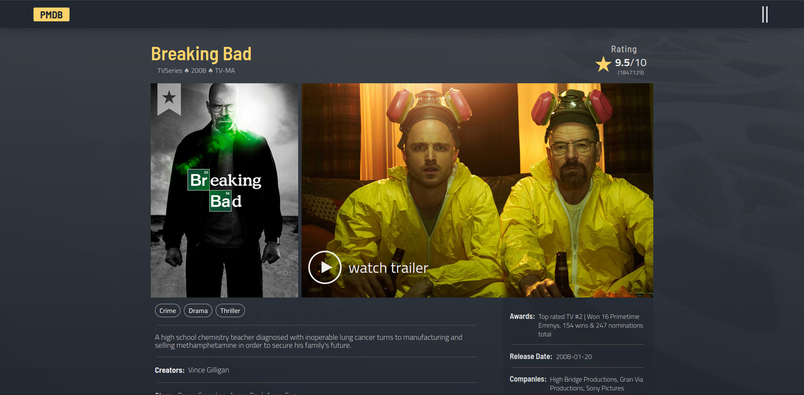

# Project Name

PMDB (Peter's Movie Database) :joy::joy::joy:

# Description the project.

This is a project I made using React & Redux with the help of the [IMDb API](https://imdb-api.com/api)

## Built With

- JavaScript
- CSS
- HTML
- WebPack
- React
- Redux

## Screenshots

### Desktop

### Mobile
 

## Link to the Page

[Live Demo](https://pmdb-media.netlify.app/)

## Getting Started

### Setup
- You need to have Node, npm & git installed.
- Clone the repository using this command `git clone https://github.com/Peter1907/PMDB.git`.
-You can also [Download the ZIP from this location](https://github.com/Peter1907/PMDB/archive/refs/heads/dev.zip)
- You can open the "book-store" folder using VSCode or any other editor.
- Use `npm i` to install all required node modeules.
- Use `npm start` command to open a live server.

## Authors

👤 **Author1**

- GitHub: [@Peter1907](https://github.com/Peter1907)
- Twitter: [@Peter_Beshara_](https://twitter.com/Peter_Beshara_)
- LinkedIn: [LinkedIn](https://www.linkedin.com/in/peter-beshara-b33681241/)

## 🤝 Contributing

Contributions, issues, and feature requests are welcome!

You can clone the repo using this link (https://github.com/Peter1907/PMDB.git)

Feel free to check the [issues page](https://github.com/Peter1907/PMDB/issues).

## Show your support

Give a ⭐️ if you like this project!

## Acknowledgments

- A big kudos to everyone who worked hard to make this project a success.
- Background photo by <a href="https://unsplash.com/@dmjdenise?utm_source=unsplash&utm_medium=referral&utm_content=creditCopyText">Denise Jans</a> on <a href="https://unsplash.com/?utm_source=unsplash&utm_medium=referral&utm_content=creditCopyText">Unsplash</a>

## 📝 License

This project is [MIT](./LICENSE) licensed.
